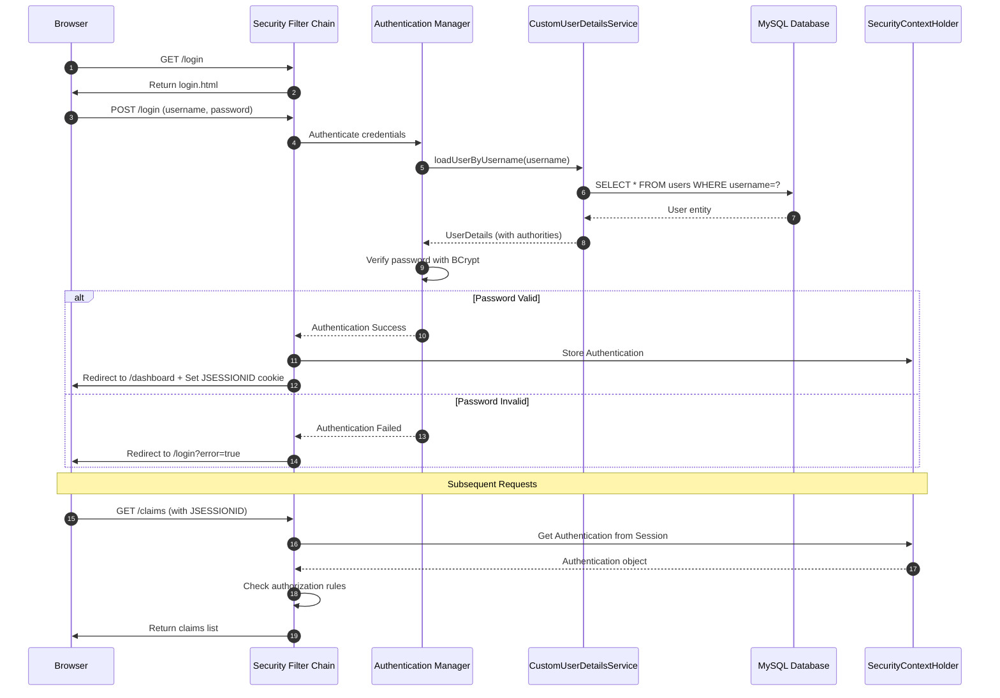
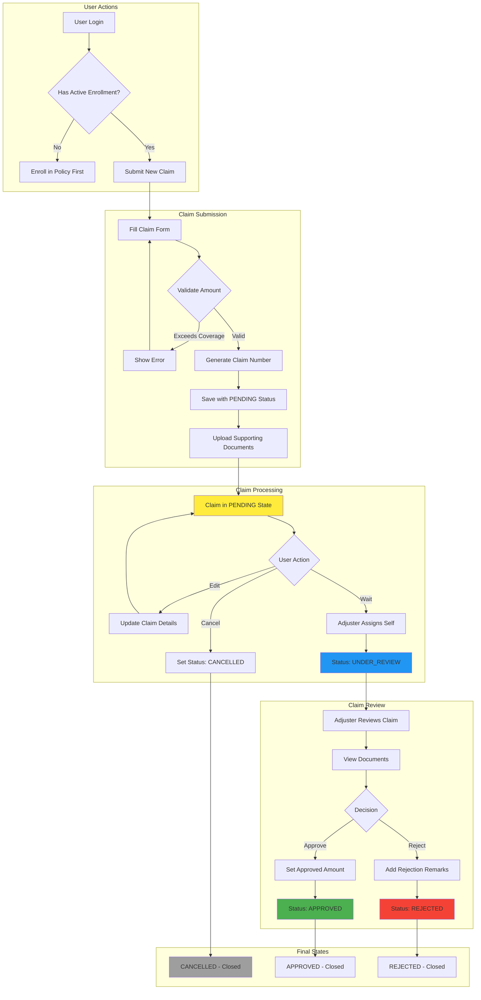
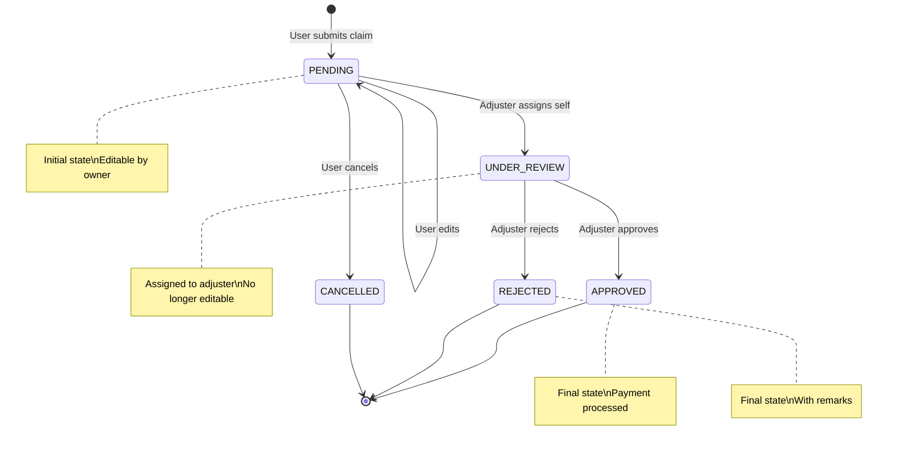
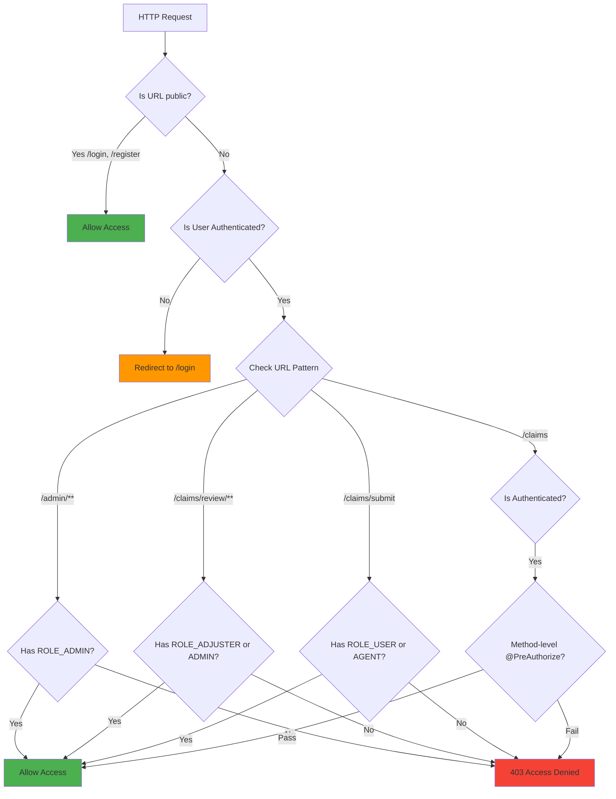

# HICMS - COMPLETE TECHNICAL REPORT
## Health Insurance Claim Management System
### Comprehensive Guide: Annotations, Security, Claims & Interview Preparation

---

# TABLE OF CONTENTS

1. [Comprehensive Annotation Guide](#1-comprehensive-annotation-guide)
2. [Authentication & Security Breakdown](#2-authentication--security-breakdown)
3. [Claim Management Module](#3-claim-management-module)
4. [Flow Diagrams (Mermaid.js)](#4-flow-diagrams-mermaidjs)
5. [Key Security Definitions](#5-key-security-definitions)
6. [Interview Questions & Answers](#6-interview-questions--answers)

---

# 1. COMPREHENSIVE ANNOTATION GUIDE

## 1.1 Spring Boot Core Annotations

### @SpringBootApplication
```java
@SpringBootApplication
public class HealthInsuranceClaimManagementApplication {
    public static void main(String[] args) {
        SpringApplication.run(HealthInsuranceClaimManagementApplication.class, args);
    }
}
```

| Aspect | Description |
|--------|-------------|
| **Purpose** | Entry point of Spring Boot application |
| **Combines** | `@Configuration` + `@EnableAutoConfiguration` + `@ComponentScan` |
| **In HICMS** | Bootstraps the entire application, enables auto-configuration for JPA, Security, Thymeleaf |

### @Configuration
```java
@Configuration
@EnableWebSecurity
@EnableMethodSecurity
public class SecurityConfig { ... }
```

| Aspect | Description |
|--------|-------------|
| **Purpose** | Marks class as source of bean definitions |
| **In HICMS** | Used in `SecurityConfig` to define security beans |
| **Creates** | Spring IoC container reads and instantiates @Bean methods |

### @Bean
```java
@Bean
public PasswordEncoder passwordEncoder() {
    return new BCryptPasswordEncoder();
}

@Bean
public SecurityFilterChain filterChain(HttpSecurity http) { ... }
```

| Aspect | Description |
|--------|-------------|
| **Purpose** | Declares a method that returns a Spring-managed bean |
| **In HICMS** | Creates `PasswordEncoder`, `AuthenticationManager`, `SecurityFilterChain` |
| **Lifecycle** | Singleton by default, managed by Spring container |

---

## 1.2 Stereotype Annotations (Component Scanning)

### @Controller
```java
@Controller
@RequestMapping("/claims")
@RequiredArgsConstructor
public class ClaimController { ... }
```

| Aspect | Description |
|--------|-------------|
| **Purpose** | Marks class as Spring MVC controller (returns views) |
| **In HICMS** | `ClaimController`, `AuthController`, `DashboardController` |
| **Behavior** | Handles HTTP requests, returns view names for Thymeleaf |

### @RestController
```java
@RestController
@RequestMapping("/api/enrollments")
public class EnrollmentApiController { ... }
```

| Aspect | Description |
|--------|-------------|
| **Purpose** | Combines `@Controller` + `@ResponseBody` |
| **In HICMS** | REST APIs for AJAX calls |
| **Behavior** | Returns JSON/XML directly (not view names) |

### @Service
```java
@Service
@RequiredArgsConstructor
@Transactional
public class ClaimServiceImpl implements ClaimService { ... }
```

| Aspect | Description |
|--------|-------------|
| **Purpose** | Marks class as service layer component |
| **In HICMS** | `ClaimServiceImpl`, `UserServiceImpl`, `DocumentServiceImpl` |
| **Behavior** | Contains business logic, transaction management |

### @Repository
```java
@Repository
public interface ClaimRepository extends JpaRepository<Claim, Long> { ... }
```

| Aspect | Description |
|--------|-------------|
| **Purpose** | Marks class as data access component |
| **In HICMS** | `ClaimRepository`, `UserRepository`, `PolicyRepository` |
| **Special** | Enables exception translation (converts SQL exceptions to Spring's DataAccessException) |

### @Component
```java
@Component
public class DataInitializer { ... }
```

| Aspect | Description |
|--------|-------------|
| **Purpose** | Generic Spring-managed component |
| **In HICMS** | Utility classes, initializers |
| **Relationship** | Parent of @Controller, @Service, @Repository |

---

## 1.3 JPA/Hibernate Annotations (Entity Layer)

### @Entity & @Table
```java
@Entity
@Table(name = "claims")
public class Claim { ... }
```

| Aspect | Description |
|--------|-------------|
| **@Entity** | Marks class as JPA entity (maps to DB table) |
| **@Table** | Specifies table name (default: class name) |
| **In HICMS** | `Claim`, `User`, `Policy`, `Document`, `PolicyEnrollment` |

### @Id & @GeneratedValue
```java
@Id
@GeneratedValue(strategy = GenerationType.IDENTITY)
private Long claimId;
```

| Aspect | Description |
|--------|-------------|
| **@Id** | Marks field as primary key |
| **@GeneratedValue** | Auto-generate ID values |
| **IDENTITY** | Uses database AUTO_INCREMENT |
| **In HICMS** | All entities use IDENTITY strategy for MySQL |

### @Column
```java
@Column(unique = true, nullable = false, length = 50)
private String claimNumber;

@Column(name = "claim_amount", precision = 12, scale = 2)
private BigDecimal claimAmount;
```

| Property | Description | Example |
|----------|-------------|---------|
| `name` | Column name in DB | `claim_amount` |
| `nullable` | Allow NULL | `false` = NOT NULL |
| `unique` | Unique constraint | Claim number |
| `length` | VARCHAR length | 50 characters |
| `precision/scale` | Decimal precision | DECIMAL(12,2) |

### @ManyToOne & @JoinColumn
```java
@ManyToOne(fetch = FetchType.LAZY)
@JoinColumn(name = "policy_id", nullable = false)
private Policy policy;
```

| Aspect | Description |
|--------|-------------|
| **@ManyToOne** | Many claims belong to one policy |
| **@JoinColumn** | Specifies foreign key column name |
| **FetchType.LAZY** | Load related entity only when accessed |
| **In HICMS** | Claim→Policy, Claim→User (claimant, agent, adjuster) |

### @OneToMany
```java
@OneToMany(mappedBy = "claim", cascade = CascadeType.ALL, fetch = FetchType.LAZY)
private List<Document> documents = new ArrayList<>();
```

| Aspect | Description |
|--------|-------------|
| **mappedBy** | Field name in child entity that owns the relationship |
| **cascade** | Operations cascade to children |
| **In HICMS** | Claim has many Documents |

### @Enumerated
```java
@Enumerated(EnumType.STRING)
@Column(name = "claim_status", nullable = false)
private ClaimStatus claimStatus;
```

| Aspect | Description |
|--------|-------------|
| **EnumType.STRING** | Store as "PENDING", "APPROVED" (text) |
| **EnumType.ORDINAL** | Store as 0, 1, 2 (numbers) - NOT recommended |
| **In HICMS** | `ClaimStatus`, `Role`, `EnrollmentStatus` |

### @PrePersist & @PreUpdate
```java
@PrePersist
protected void onCreate() {
    createdDate = LocalDateTime.now();
    updatedDate = LocalDateTime.now();
}

@PreUpdate
protected void onUpdate() {
    updatedDate = LocalDateTime.now();
}
```

| Aspect | Description |
|--------|-------------|
| **@PrePersist** | Callback before INSERT |
| **@PreUpdate** | Callback before UPDATE |
| **In HICMS** | Auto-set timestamps on all entities |

---

## 1.4 Web/MVC Annotations

### @RequestMapping
```java
@Controller
@RequestMapping("/claims")
public class ClaimController { ... }
```

| Aspect | Description |
|--------|-------------|
| **Purpose** | Maps HTTP requests to handler methods/classes |
| **Class level** | Base URL for all methods |
| **In HICMS** | `/claims`, `/policies`, `/enrollments`, `/admin` |

### @GetMapping & @PostMapping
```java
@GetMapping("/submit")
public String submitClaimForm(Model model) { ... }

@PostMapping("/submit")
public String submitClaim(@Valid @ModelAttribute ClaimDTO claimDTO) { ... }
```

| Annotation | HTTP Method | Purpose |
|------------|-------------|---------|
| `@GetMapping` | GET | Retrieve data, show forms |
| `@PostMapping` | POST | Submit data, create resources |
| `@PutMapping` | PUT | Update resources |
| `@DeleteMapping` | DELETE | Remove resources |

### @PathVariable
```java
@GetMapping("/view/{id}")
public String viewClaim(@PathVariable Long id, Model model) { ... }
```

| Aspect | Description |
|--------|-------------|
| **Purpose** | Extract value from URL path |
| **Example** | `/claims/view/5` → `id = 5` |
| **In HICMS** | View, edit, review claims by ID |

### @RequestParam
```java
@PostMapping("/submit")
public String submitClaim(
    @RequestParam(required = false) Long customerId,
    @RequestParam(value = "documents", required = false) List<MultipartFile> documents
) { ... }
```

| Property | Description |
|----------|-------------|
| `required` | Is parameter mandatory? |
| `defaultValue` | Default if not provided |
| `value` | Parameter name |

### @ModelAttribute
```java
@PostMapping("/submit")
public String submitClaim(@ModelAttribute("claim") ClaimDTO claimDTO) { ... }
```

| Aspect | Description |
|--------|-------------|
| **Purpose** | Bind form data to Java object |
| **In HICMS** | HTML form → ClaimDTO, UserDTO |
| **"claim"** | Model attribute name for Thymeleaf |

### @Valid
```java
@PostMapping("/submit")
public String submitClaim(
    @Valid @ModelAttribute("claim") ClaimDTO claimDTO,
    BindingResult result
) { ... }
```

| Aspect | Description |
|--------|-------------|
| **Purpose** | Trigger Bean Validation |
| **Checks** | @NotNull, @NotBlank, @Size, @DecimalMin |
| **BindingResult** | Contains validation errors |

### @AuthenticationPrincipal
```java
@GetMapping
public String listClaims(@AuthenticationPrincipal UserDetails userDetails) {
    String username = userDetails.getUsername();
    // Get current logged-in user's claims
}
```

| Aspect | Description |
|--------|-------------|
| **Purpose** | Inject current authenticated user |
| **Returns** | `UserDetails` object from SecurityContext |
| **In HICMS** | Get current user in all authenticated endpoints |

---

## 1.5 Security Annotations

### @EnableWebSecurity
```java
@Configuration
@EnableWebSecurity
public class SecurityConfig { ... }
```

| Aspect | Description |
|--------|-------------|
| **Purpose** | Enable Spring Security's web security support |
| **Effect** | Activates security filter chain |
| **In HICMS** | Applied to `SecurityConfig` class |

### @EnableMethodSecurity
```java
@Configuration
@EnableMethodSecurity
public class SecurityConfig { ... }
```

| Aspect | Description |
|--------|-------------|
| **Purpose** | Enable method-level security annotations |
| **Enables** | `@PreAuthorize`, `@PostAuthorize`, `@Secured` |
| **In HICMS** | Used throughout controllers |

### @PreAuthorize
```java
@GetMapping("/submit")
@PreAuthorize("hasAnyRole('USER', 'AGENT')")
public String submitClaimForm() { ... }

@PostMapping("/review/{id}")
@PreAuthorize("hasAnyRole('CLAIM_ADJUSTER', 'ADMIN')")
public String reviewClaim() { ... }
```

| Expression | Description | In HICMS |
|------------|-------------|----------|
| `hasRole('ADMIN')` | Has specific role | Admin-only operations |
| `hasAnyRole('A','B')` | Has any of roles | Submit: USER or AGENT |
| `isAuthenticated()` | Is logged in | General access |
| `@user.userId == principal.id` | Custom SpEL | Owner check |

---

## 1.6 Lombok Annotations

### @Getter & @Setter
```java
@Getter
@Setter
public class Claim { 
    private Long claimId;  // getClaimId(), setClaimId() auto-generated
}
```

### @NoArgsConstructor & @AllArgsConstructor
```java
@NoArgsConstructor   // public Claim() {}
@AllArgsConstructor  // public Claim(Long claimId, String claimNumber, ...) {}
public class Claim { ... }
```

### @RequiredArgsConstructor
```java
@Service
@RequiredArgsConstructor
public class ClaimServiceImpl {
    private final ClaimRepository claimRepository;  // Injected via constructor
    private final PolicyRepository policyRepository;
    // Generates: public ClaimServiceImpl(ClaimRepository cr, PolicyRepository pr) {...}
}
```

### @Builder
```java
@Builder
public class Claim { ... }

// Usage:
Claim claim = Claim.builder()
    .claimNumber("CLM-20260201-001")
    .claimAmount(new BigDecimal("2500.00"))
    .claimStatus(ClaimStatus.PENDING)
    .build();
```

### @Data
```java
@Data  // Combines @Getter, @Setter, @ToString, @EqualsAndHashCode, @RequiredArgsConstructor
public class ClaimDTO { ... }
```

---

## 1.7 Transaction Annotation

### @Transactional
```java
@Service
@Transactional  // Class-level: applies to all methods
public class ClaimServiceImpl {
    
    @Override
    @Transactional(readOnly = true)  // Method-level override
    public Optional<Claim> findById(Long id) { ... }
    
    @Override  // Uses class-level @Transactional (read-write)
    public Claim submitClaim(ClaimDTO dto, User user) { ... }
}
```

| Property | Description |
|----------|-------------|
| Default | Read-write transaction |
| `readOnly = true` | Optimize for reads (no dirty checking) |
| `propagation` | How transaction propagates |
| `isolation` | Transaction isolation level |
| `rollbackFor` | Exceptions that trigger rollback |

---

# 2. AUTHENTICATION & SECURITY BREAKDOWN

## 2.1 Authentication Mechanism in HICMS

HICMS uses **Form-Based Authentication** with **Spring Security** (not JWT/OAuth2).

### Authentication Components

```
┌─────────────────────────────────────────────────────────────────────────────┐
│                    SPRING SECURITY AUTHENTICATION FLOW                      │
└─────────────────────────────────────────────────────────────────────────────┘

┌──────────────┐      ┌────────────────────┐      ┌─────────────────────────┐
│   Browser    │─────▶│  Security Filter   │─────▶│  Authentication        │
│   (Login)    │      │  Chain             │      │  Manager               │
└──────────────┘      └────────────────────┘      └───────────┬─────────────┘
                                                              │
                                                              ▼
┌──────────────┐      ┌────────────────────┐      ┌─────────────────────────┐
│  Session     │◀─────│  Security Context  │◀─────│  DaoAuthentication     │
│  Created     │      │  Holder            │      │  Provider              │
└──────────────┘      └────────────────────┘      └───────────┬─────────────┘
                                                              │
                                                              ▼
                                                  ┌─────────────────────────┐
                                                  │  CustomUserDetails      │
                                                  │  Service                │
                                                  └───────────┬─────────────┘
                                                              │
                                                              ▼
                                                  ┌─────────────────────────┐
                                                  │  UserRepository         │
                                                  │  (Database)             │
                                                  └─────────────────────────┘
```

### Security Configuration Breakdown

```java
@Configuration
@EnableWebSecurity
@EnableMethodSecurity
@RequiredArgsConstructor
public class SecurityConfig {
    
    private final CustomUserDetailsService userDetailsService;
    
    // ═══════════════════════════════════════════════════════════════════════
    // 1. PASSWORD ENCODER - BCrypt for secure password hashing
    // ═══════════════════════════════════════════════════════════════════════
    @Bean
    public PasswordEncoder passwordEncoder() {
        return new BCryptPasswordEncoder();
        // Hashes passwords with salt, 10 rounds by default
        // Example: "password123" → "$2a$10$N9qo8uLOickgx2ZMRZoMy..."
    }
    
    // ═══════════════════════════════════════════════════════════════════════
    // 2. AUTHENTICATION PROVIDER - Uses UserDetailsService + PasswordEncoder
    // ═══════════════════════════════════════════════════════════════════════
    @Bean
    public DaoAuthenticationProvider authenticationProvider() {
        DaoAuthenticationProvider authProvider = new DaoAuthenticationProvider();
        authProvider.setUserDetailsService(userDetailsService);
        authProvider.setPasswordEncoder(passwordEncoder());
        return authProvider;
    }
    
    // ═══════════════════════════════════════════════════════════════════════
    // 3. SECURITY FILTER CHAIN - Defines security rules
    // ═══════════════════════════════════════════════════════════════════════
    @Bean
    public SecurityFilterChain filterChain(HttpSecurity http) throws Exception {
        http
            // Disable CSRF (for simplicity; enable in production)
            .csrf(csrf -> csrf.disable())
            
            // URL-based authorization rules
            .authorizeHttpRequests(auth -> auth
                // Public pages
                .requestMatchers("/", "/home", "/login", "/register").permitAll()
                .requestMatchers("/css/**", "/js/**", "/images/**").permitAll()
                
                // Role-based access
                .requestMatchers("/admin/**").hasRole("ADMIN")
                .requestMatchers("/claims/**").authenticated()
                
                // All other requests need authentication
                .anyRequest().authenticated()
            )
            
            // Form login configuration
            .formLogin(form -> form
                .loginPage("/login")           // Custom login page
                .loginProcessingUrl("/login")  // Form submission URL
                .defaultSuccessUrl("/dashboard", true)  // Redirect after login
                .failureUrl("/login?error=true")
                .permitAll()
            )
            
            // Logout configuration
            .logout(logout -> logout
                .logoutRequestMatcher(new AntPathRequestMatcher("/logout"))
                .logoutSuccessUrl("/login?logout=true")
                .invalidateHttpSession(true)   // Clear session
                .deleteCookies("JSESSIONID")   // Remove session cookie
                .permitAll()
            );
        
        return http.build();
    }
}
```

### CustomUserDetailsService

```java
@Service
@RequiredArgsConstructor
public class CustomUserDetailsService implements UserDetailsService {
    
    private final UserRepository userRepository;
    
    @Override
    @Transactional(readOnly = true)
    public UserDetails loadUserByUsername(String username) throws UsernameNotFoundException {
        // 1. Find user in database
        User user = userRepository.findByUsername(username)
                .orElseThrow(() -> new UsernameNotFoundException("User not found: " + username));
        
        // 2. Convert to Spring Security's UserDetails
        return new org.springframework.security.core.userdetails.User(
                user.getUsername(),
                user.getPassword(),      // BCrypt hashed password
                user.isEnabled(),        // Account enabled?
                true,                    // Account not expired
                true,                    // Credentials not expired
                true,                    // Account not locked
                Collections.singletonList(
                    new SimpleGrantedAuthority("ROLE_" + user.getRole().name())
                )
                // ROLE_USER, ROLE_ADMIN, ROLE_AGENT, ROLE_CLAIM_ADJUSTER
        );
    }
}
```

## 2.2 Understanding "Claims" in Security Context

> **IMPORTANT**: In this application, "Claims" has TWO meanings:
> 1. **Insurance Claims** - The business domain (Claim entity)
> 2. **Security Claims** - Part of authentication tokens (not used in this app)

### Security Claims (JWT Context - For Reference)

If HICMS used JWT authentication, claims would be:

```json
{
  "sub": "john.doe",           // Subject (username)
  "iat": 1706745600,           // Issued At
  "exp": 1706832000,           // Expiration
  "roles": ["ROLE_USER"],      // Custom claim: user roles
  "userId": 5                  // Custom claim: user ID
}
```

| Claim | Type | Description |
|-------|------|-------------|
| `sub` | Registered | Subject (who the token is about) |
| `iat` | Registered | When token was issued |
| `exp` | Registered | When token expires |
| `roles` | Custom | User's roles/authorities |
| `userId` | Custom | Application-specific data |

### HICMS Approach (Session-Based)

Instead of JWT claims, HICMS stores user information in:

1. **HttpSession** - Server-side session storage
2. **SecurityContextHolder** - Holds authentication object
3. **JSESSIONID Cookie** - Session identifier in browser

```java
// Getting current user's information
@AuthenticationPrincipal UserDetails userDetails

// The UserDetails contains:
// - username
// - password (hashed)
// - authorities (roles)
// - enabled status
```

---

# 3. CLAIM MANAGEMENT MODULE

## 3.1 Module Overview

The Claim Management Module handles the complete lifecycle of insurance claims from submission to approval/rejection.

### Entities Involved

```
┌─────────────────────────────────────────────────────────────────────────────┐
│                         CLAIM MODULE ENTITIES                               │
└─────────────────────────────────────────────────────────────────────────────┘

┌──────────────┐     ┌──────────────┐     ┌──────────────┐
│    User      │     │    Policy    │     │   Document   │
│  (Claimant)  │     │              │     │              │
└──────┬───────┘     └──────┬───────┘     └──────┬───────┘
       │                    │                    │
       │ files              │ for               │ attached to
       │                    │                    │
       └────────────┬───────┴────────────────────┘
                    │
                    ▼
              ┌──────────────┐
              │    CLAIM     │
              │              │
              │ - claimId    │
              │ - claimNumber│
              │ - amount     │
              │ - status     │
              │ - remarks    │
              └──────────────┘
                    │
        ┌───────────┼───────────┐
        │           │           │
        ▼           ▼           ▼
    ┌───────┐   ┌───────┐   ┌───────┐
    │ Agent │   │Adjuster│   │ User  │
    │(files)│   │(reviews)   │(owner)│
    └───────┘   └───────┘   └───────┘
```

### ClaimStatus Enum

```java
public enum ClaimStatus {
    PENDING,        // Initial state after submission
    UNDER_REVIEW,   // Assigned to adjuster
    APPROVED,       // Claim approved
    REJECTED,       // Claim rejected
    CANCELLED       // Cancelled by user
}
```

### Business Rules

| Rule | Description |
|------|-------------|
| **Enrollment Required** | User must be enrolled in policy to file claim |
| **Amount Validation** | Claim amount cannot exceed coverage amount |
| **Edit Restriction** | Only PENDING claims can be edited |
| **Cancel Restriction** | Only PENDING claims can be cancelled |
| **Review Access** | Only ADJUSTER and ADMIN can review claims |
| **Owner Access** | Users can only edit/cancel their own claims |

## 3.2 Key Business Logic

### Claim Submission

```java
public Claim submitClaimWithAgent(ClaimDTO claimDTO, User claimant, User agent) {
    
    // 1. VALIDATE POLICY EXISTS
    Policy policy = policyRepository.findById(claimDTO.getPolicyId())
            .orElseThrow(() -> new RuntimeException("Policy not found"));
    
    // 2. VALIDATE ENROLLMENT
    boolean isEnrolled = enrollmentRepository
            .existsByPolicyholderUserIdAndPolicyPolicyIdAndEnrollmentStatusIn(
                    claimant.getUserId(),
                    claimDTO.getPolicyId(),
                    Arrays.asList(PolicyEnrollment.EnrollmentStatus.ACTIVE)
            );
    
    if (!isEnrolled) {
        throw new RuntimeException("User is not enrolled in this policy");
    }
    
    // 3. VALIDATE AMOUNT
    if (claimDTO.getClaimAmount().compareTo(policy.getCoverageAmount()) > 0) {
        throw new RuntimeException("Claim amount exceeds coverage amount");
    }
    
    // 4. CREATE CLAIM
    Claim claim = Claim.builder()
            .claimNumber(generateClaimNumber())
            .policy(policy)
            .claimant(claimant)
            .agent(agent)
            .claimAmount(claimDTO.getClaimAmount())
            .claimDate(LocalDate.now())
            .description(claimDTO.getDescription())
            .claimStatus(ClaimStatus.PENDING)
            .build();
    
    // 5. PERSIST
    return claimRepository.save(claim);
}
```

### Claim Review

```java
public Claim reviewClaim(Long claimId, ClaimReviewDTO reviewDTO, User adjuster) {
    
    // 1. FIND CLAIM
    Claim claim = claimRepository.findById(claimId)
            .orElseThrow(() -> new RuntimeException("Claim not found"));
    
    // 2. UPDATE WITH DECISION
    claim.setAdjuster(adjuster);
    claim.setClaimStatus(reviewDTO.getClaimStatus());  // APPROVED or REJECTED
    claim.setApprovedAmount(reviewDTO.getApprovedAmount());
    claim.setRemarks(reviewDTO.getRemarks());
    
    // 3. SAVE
    return claimRepository.save(claim);
}
```

---

# 4. FLOW DIAGRAMS (MERMAID.JS)

## 4.1 Authentication Flow Diagram



## 4.2 Claim Lifecycle Flow Diagram



## 4.3 Claim Status State Diagram



## 4.4 Authorization Decision Flow



---

# 5. KEY SECURITY DEFINITIONS

## 5.1 Core Security Concepts

### Authentication
> **Definition**: The process of verifying the identity of a user, device, or system.

| Aspect | Description |
|--------|-------------|
| **What it answers** | "Who are you?" |
| **In HICMS** | Username + password verification via form login |
| **Mechanism** | BCrypt password comparison |
| **Result** | `Authentication` object in SecurityContext |

```java
// After successful authentication:
Authentication auth = SecurityContextHolder.getContext().getAuthentication();
String username = auth.getName();  // "john.doe"
Collection<? extends GrantedAuthority> roles = auth.getAuthorities();  // [ROLE_USER]
```

---

### Authorization
> **Definition**: The process of determining whether an authenticated user has permission to access a resource.

| Aspect | Description |
|--------|-------------|
| **What it answers** | "What are you allowed to do?" |
| **In HICMS** | Role-based access control (RBAC) |
| **Levels** | URL-level + Method-level |

```java
// URL-level (SecurityConfig)
.requestMatchers("/admin/**").hasRole("ADMIN")

// Method-level (Controller)
@PreAuthorize("hasAnyRole('CLAIM_ADJUSTER', 'ADMIN')")
public String reviewClaim() { ... }
```

---

### JWT (JSON Web Token)
> **Definition**: A compact, URL-safe token format for securely transmitting information between parties as a JSON object.

| Part | Description | Example |
|------|-------------|---------|
| **Header** | Algorithm & token type | `{"alg":"HS256","typ":"JWT"}` |
| **Payload** | Claims (data) | `{"sub":"john","role":"USER"}` |
| **Signature** | Verification | `HMACSHA256(header.payload, secret)` |

```
eyJhbGciOiJIUzI1NiJ9.eyJzdWIiOiJqb2huIiwicm9sZSI6IlVTRVIifQ.signature
└──────Header──────┘.└──────────Payload──────────────┘.└─Signature─┘
```

> **Note**: HICMS uses session-based auth, not JWT.

---

### Claims (Security Context)
> **Definition**: Pieces of information asserted about a subject (user) in a token or authentication context.

| Type | Description | Example |
|------|-------------|---------|
| **Registered** | Standard claims | `sub`, `iat`, `exp` |
| **Public** | Publicly defined | `name`, `email` |
| **Private** | Application-specific | `userId`, `roles` |

```java
// In HICMS, "claims" about the user are stored in UserDetails:
UserDetails user = userDetailsService.loadUserByUsername("john");
// Claims:
// - username: "john"
// - password: (hashed)
// - authorities: [ROLE_USER]
// - enabled: true
```

---

### SecurityContextHolder
> **Definition**: The heart of Spring Security's authentication storage mechanism. Holds the security context for the current thread.

```java
// How it works:
┌─────────────────────────────────────────────────────────────────┐
│                    SecurityContextHolder                         │
│  ┌─────────────────────────────────────────────────────────┐    │
│  │                  SecurityContext                         │    │
│  │  ┌─────────────────────────────────────────────────┐    │    │
│  │  │              Authentication                      │    │    │
│  │  │  - Principal: UserDetails                       │    │    │
│  │  │  - Credentials: (password, usually null after)  │    │    │
│  │  │  - Authorities: [ROLE_USER, ROLE_ADMIN]        │    │    │
│  │  │  - Authenticated: true/false                   │    │    │
│  │  └─────────────────────────────────────────────────┘    │    │
│  └─────────────────────────────────────────────────────────┘    │
└─────────────────────────────────────────────────────────────────┘
```

```java
// Usage in code:
Authentication auth = SecurityContextHolder.getContext().getAuthentication();
if (auth != null && auth.isAuthenticated()) {
    String username = auth.getName();
    boolean isAdmin = auth.getAuthorities().stream()
        .anyMatch(a -> a.getAuthority().equals("ROLE_ADMIN"));
}
```

---

### FilterChain
> **Definition**: A chain of filters that process incoming HTTP requests in sequence before reaching the servlet/controller.

```java
// Spring Security Filter Chain (simplified order):
┌─────────────────────────────────────────────────────────────────┐
│ HTTP Request                                                     │
└───────────────────────────┬─────────────────────────────────────┘
                            ▼
┌─────────────────────────────────────────────────────────────────┐
│ 1. SecurityContextPersistenceFilter                             │
│    → Restores SecurityContext from session                      │
└───────────────────────────┬─────────────────────────────────────┘
                            ▼
┌─────────────────────────────────────────────────────────────────┐
│ 2. UsernamePasswordAuthenticationFilter                         │
│    → Handles form login (POST /login)                          │
└───────────────────────────┬─────────────────────────────────────┘
                            ▼
┌─────────────────────────────────────────────────────────────────┐
│ 3. ExceptionTranslationFilter                                   │
│    → Handles authentication/authorization exceptions            │
└───────────────────────────┬─────────────────────────────────────┘
                            ▼
┌─────────────────────────────────────────────────────────────────┐
│ 4. FilterSecurityInterceptor                                    │
│    → Final authorization decision (URL-level)                  │
└───────────────────────────┬─────────────────────────────────────┘
                            ▼
┌─────────────────────────────────────────────────────────────────┐
│ Controller / Handler                                            │
│    → @PreAuthorize checks (method-level)                       │
└─────────────────────────────────────────────────────────────────┘
```

---

# 6. INTERVIEW QUESTIONS & ANSWERS

## Section A: Spring Boot & Annotations (15 Questions)

### Q1: What does @SpringBootApplication do internally?
**Answer:**
`@SpringBootApplication` is a convenience annotation that combines three annotations:

1. **@Configuration** - Marks the class as a source of bean definitions
2. **@EnableAutoConfiguration** - Enables Spring Boot's auto-configuration mechanism
3. **@ComponentScan** - Scans for components in the current package and sub-packages

```java
// Equivalent to:
@Configuration
@EnableAutoConfiguration
@ComponentScan
public class Application { }
```

---

### Q2: What's the difference between @Controller and @RestController?
**Answer:**

| @Controller | @RestController |
|-------------|-----------------|
| Returns view names (for template engines) | Returns data directly (JSON/XML) |
| Need @ResponseBody on each method for JSON | @ResponseBody applied automatically |
| Used with Thymeleaf, JSP | Used for REST APIs |

```java
@Controller
public class WebController {
    @GetMapping("/page")
    public String page() {
        return "page";  // Returns templates/page.html
    }
}

@RestController
public class ApiController {
    @GetMapping("/api/data")
    public ClaimDTO getData() {
        return claimDTO;  // Returns JSON automatically
    }
}
```

---

### Q3: Explain the difference between @Component, @Service, @Repository, and @Controller.
**Answer:**
All are stereotype annotations that mark classes for component scanning, but with semantic differences:

| Annotation | Purpose | Special Behavior |
|------------|---------|------------------|
| @Component | Generic component | None |
| @Service | Business logic layer | None (semantic only) |
| @Repository | Data access layer | Exception translation to DataAccessException |
| @Controller | Web layer | Handles HTTP requests |

```java
@Component      // Generic - use when none of the others fit
@Service        // Business logic - ClaimServiceImpl
@Repository     // Data access - ClaimRepository
@Controller     // Web handling - ClaimController
```

---

### Q4: What is the purpose of @Transactional and how does it work?
**Answer:**
`@Transactional` manages database transactions declaratively:

**How it works:**
1. Spring creates a proxy around the bean
2. Proxy starts transaction before method execution
3. If method succeeds → commit
4. If exception occurs → rollback

```java
@Service
@Transactional  // All methods are transactional
public class ClaimServiceImpl {
    
    @Transactional(readOnly = true)  // Optimize for reads
    public List<Claim> findAll() { }
    
    @Transactional(rollbackFor = Exception.class)  // Rollback on any exception
    public Claim submitClaim() { }
}
```

**Key properties:**
- `readOnly` - Optimization hint for read operations
- `propagation` - How to handle nested transactions
- `isolation` - Transaction isolation level
- `rollbackFor` - Exceptions that trigger rollback

---

### Q5: Explain @PreAuthorize and how it differs from URL-based security.
**Answer:**

**URL-based security (SecurityConfig):**
```java
.requestMatchers("/admin/**").hasRole("ADMIN")
```
- Applied globally in configuration
- Coarse-grained (URL patterns)
- Evaluated before reaching controller

**@PreAuthorize (Method-level):**
```java
@PreAuthorize("hasRole('ADMIN') and #userId == principal.id")
public void updateUser(Long userId) { }
```
- Applied per method
- Fine-grained (can access method parameters)
- Evaluated after reaching controller, before method executes
- Supports SpEL expressions

---

### Q6: What is the purpose of @Valid and how does it work with BindingResult?
**Answer:**
`@Valid` triggers Bean Validation (JSR-380) on an object:

```java
@PostMapping("/submit")
public String submit(
    @Valid @ModelAttribute("claim") ClaimDTO claimDTO,  // Validate this object
    BindingResult result  // Must immediately follow @Valid parameter
) {
    if (result.hasErrors()) {
        return "claim/form";  // Return to form with errors
    }
    // Process valid data
}
```

**ClaimDTO with validation:**
```java
public class ClaimDTO {
    @NotNull(message = "Policy is required")
    private Long policyId;
    
    @DecimalMin(value = "0.01", message = "Amount must be positive")
    private BigDecimal claimAmount;
    
    @NotBlank(message = "Description required")
    @Size(max = 1000, message = "Max 1000 characters")
    private String description;
}
```

---

### Q7: Explain FetchType.LAZY vs FetchType.EAGER in JPA.
**Answer:**

| FetchType | Behavior | SQL |
|-----------|----------|-----|
| **LAZY** | Load when accessed | Separate query |
| **EAGER** | Load immediately | JOIN in same query |

```java
@Entity
public class Claim {
    @ManyToOne(fetch = FetchType.LAZY)  // Recommended
    private Policy policy;
    
    @ManyToOne(fetch = FetchType.EAGER)  // Load immediately
    private User claimant;
}
```

**LAZY loading example:**
```java
Claim claim = claimRepository.findById(1L);  // Only loads Claim
// SQL: SELECT * FROM claims WHERE claim_id = 1

String policyName = claim.getPolicy().getPolicyName();  // Now loads Policy
// SQL: SELECT * FROM policies WHERE policy_id = ?
```

**Best Practice:** Use LAZY by default, EAGER only when always needed.

---

### Q8: What is the purpose of @Builder from Lombok?
**Answer:**
`@Builder` generates a builder pattern implementation:

```java
@Builder
public class Claim {
    private Long claimId;
    private String claimNumber;
    private BigDecimal claimAmount;
}

// Usage:
Claim claim = Claim.builder()
    .claimNumber("CLM-001")
    .claimAmount(new BigDecimal("2500.00"))
    .build();
```

**Benefits:**
- Readable object construction
- Optional parameters
- Immutability-friendly
- No need for telescoping constructors

---

### Q9: What does @RequiredArgsConstructor do and why is it preferred for dependency injection?
**Answer:**
`@RequiredArgsConstructor` generates a constructor for all `final` fields:

```java
@Service
@RequiredArgsConstructor
public class ClaimServiceImpl {
    private final ClaimRepository claimRepository;    // Injected
    private final PolicyRepository policyRepository;  // Injected
    
    // Lombok generates:
    // public ClaimServiceImpl(ClaimRepository cr, PolicyRepository pr) {
    //     this.claimRepository = cr;
    //     this.policyRepository = pr;
    // }
}
```

**Why constructor injection is preferred:**
1. **Immutability** - Fields can be final
2. **Testability** - Easy to mock in tests
3. **Required dependencies** - Cannot create object without dependencies
4. **No reflection** - Unlike @Autowired on fields

---

### Q10: Explain @Enumerated(EnumType.STRING) vs ORDINAL.
**Answer:**

```java
public enum ClaimStatus {
    PENDING,      // ORDINAL: 0, STRING: "PENDING"
    APPROVED,     // ORDINAL: 1, STRING: "APPROVED"
    REJECTED      // ORDINAL: 2, STRING: "REJECTED"
}
```

| Type | Storage | Value |
|------|---------|-------|
| **ORDINAL** | Integer | 0, 1, 2 |
| **STRING** | Varchar | "PENDING", "APPROVED" |

**Why STRING is preferred:**
```java
@Enumerated(EnumType.STRING)  // Use this
private ClaimStatus status;
```

1. **Readability** - Database shows "PENDING" not "0"
2. **Safety** - Adding new enum values doesn't break existing data
3. **Refactoring** - Can reorder enums without data corruption

---

## Section B: Security Questions (15 Questions)

### Q11: Explain how Spring Security's authentication flow works in HICMS.
**Answer:**

1. **User submits login form** (POST /login)
2. **UsernamePasswordAuthenticationFilter** intercepts request
3. **AuthenticationManager** delegates to **DaoAuthenticationProvider**
4. **CustomUserDetailsService.loadUserByUsername()** queries database
5. **BCryptPasswordEncoder** verifies password
6. **On success:**
   - Creates `Authentication` object
   - Stores in `SecurityContextHolder`
   - Creates HTTP session
   - Sets JSESSIONID cookie
   - Redirects to /dashboard
7. **On failure:** Redirects to /login?error=true

---

### Q12: What is SecurityContextHolder and how is authentication stored?
**Answer:**
`SecurityContextHolder` is the core storage mechanism for security information:

```java
// Structure:
SecurityContextHolder
    └── SecurityContext
            └── Authentication
                    ├── Principal (UserDetails)
                    ├── Credentials (password, usually cleared)
                    ├── Authorities (roles)
                    └── isAuthenticated (boolean)
```

**Storage strategies:**
- `MODE_THREADLOCAL` (default) - Each thread has its own context
- `MODE_INHERITABLETHREADLOCAL` - Child threads inherit
- `MODE_GLOBAL` - Single context for entire application

```java
// Getting current user:
Authentication auth = SecurityContextHolder.getContext().getAuthentication();
String username = auth.getName();
```

---

### Q13: How does @PreAuthorize handle role checking?
**Answer:**
`@PreAuthorize` uses Spring Expression Language (SpEL):

```java
@PreAuthorize("hasRole('ADMIN')")
// Checks: authorities.contains("ROLE_ADMIN")

@PreAuthorize("hasAnyRole('USER', 'AGENT')")
// Checks: authorities.containsAny(["ROLE_USER", "ROLE_AGENT"])

@PreAuthorize("hasRole('USER') and #claim.claimant.userId == principal.id")
// Complex: Role check + parameter access
```

**How it works:**
1. Method invocation intercepted by Spring AOP
2. SpEL expression evaluated
3. If true → method executes
4. If false → AccessDeniedException thrown

---

### Q14: Why does HICMS add "ROLE_" prefix to roles?
**Answer:**
Spring Security conventions require the "ROLE_" prefix for `hasRole()`:

```java
// In CustomUserDetailsService:
new SimpleGrantedAuthority("ROLE_" + user.getRole().name())
// Creates: ROLE_USER, ROLE_ADMIN, ROLE_AGENT, ROLE_CLAIM_ADJUSTER

// In @PreAuthorize:
@PreAuthorize("hasRole('ADMIN')")
// Spring automatically checks for "ROLE_ADMIN"

// Alternative without prefix:
@PreAuthorize("hasAuthority('ADMIN')")
// Checks for exactly "ADMIN"
```

---

### Q15: What is the purpose of BCryptPasswordEncoder?
**Answer:**
BCrypt is a password hashing algorithm designed for security:

```java
@Bean
public PasswordEncoder passwordEncoder() {
    return new BCryptPasswordEncoder();
}
```

**Features:**
1. **Salt** - Random salt per password (stored in hash)
2. **Adaptive** - Work factor can be increased
3. **Slow** - Intentionally slow to prevent brute force

```java
// Hashing:
String hash = encoder.encode("password123");
// Result: $2a$10$N9qo8uLOickgx2ZMRZoMy...
//         ↑  ↑ └── Hash
//         │  └── Work factor (10 = 2^10 iterations)
//         └── Algorithm version

// Verification:
boolean matches = encoder.matches("password123", hash);  // true
```

---

### Q16: How does session-based authentication work vs JWT?
**Answer:**

| Aspect | Session-Based (HICMS) | JWT |
|--------|----------------------|-----|
| **Storage** | Server (HttpSession) | Client (localStorage/cookie) |
| **Identifier** | JSESSIONID cookie | Token in header |
| **Scalability** | Needs session replication | Stateless |
| **Revocation** | Easy (invalidate session) | Hard (needs blacklist) |
| **Size** | Small cookie | Larger token |

**HICMS Flow:**
```
Login → Create Session → Store in Server → Send JSESSIONID cookie
Request → Send cookie → Server looks up session → Get Authentication
```

**JWT Flow:**
```
Login → Generate Token → Send to client → Client stores
Request → Send token in header → Server validates signature → Extract claims
```

---

### Q17: Explain the filter chain in Spring Security.
**Answer:**
Requests pass through multiple filters in order:

```
Request → SecurityContextPersistenceFilter
        → HeaderWriterFilter
        → CsrfFilter (if enabled)
        → LogoutFilter
        → UsernamePasswordAuthenticationFilter
        → RequestCacheAwareFilter
        → SecurityContextHolderAwareRequestFilter
        → AnonymousAuthenticationFilter
        → SessionManagementFilter
        → ExceptionTranslationFilter
        → FilterSecurityInterceptor
        → Controller
```

**Key filters in HICMS:**
1. **SecurityContextPersistenceFilter** - Restores context from session
2. **UsernamePasswordAuthenticationFilter** - Handles form login
3. **ExceptionTranslationFilter** - Handles auth exceptions
4. **FilterSecurityInterceptor** - Makes authorization decisions

---

### Q18: How does HICMS handle access denied scenarios?
**Answer:**

```java
// In SecurityConfig:
.exceptionHandling(ex -> ex
    .accessDeniedPage("/access-denied")
)
```

**Scenarios:**
1. **Not authenticated** → Redirect to /login
2. **Authenticated but not authorized** → Show /access-denied page

```java
// In Controller (method-level):
@PreAuthorize("hasRole('ADMIN')")
public String adminOnly() { }

// If user without ADMIN role calls this:
// → AccessDeniedException thrown
// → ExceptionTranslationFilter catches
// → Redirects to /access-denied
```

---

### Q19: What is CSRF and why is it disabled in HICMS?
**Answer:**
**CSRF (Cross-Site Request Forgery):** Attack where malicious site tricks user's browser into making requests to another site where user is authenticated.

```java
.csrf(csrf -> csrf.disable())  // Disabled in HICMS
```

**Why it might be disabled:**
1. Development/testing convenience
2. REST APIs with token-based auth
3. Single-page applications

**Why it should be enabled in production:**
```java
.csrf(csrf -> csrf
    .csrfTokenRepository(CookieCsrfTokenRepository.withHttpOnlyFalse())
)
```

Then in forms:
```html
<input type="hidden" th:name="${_csrf.parameterName}" th:value="${_csrf.token}"/>
```

---

### Q20: How does @AuthenticationPrincipal work?
**Answer:**
`@AuthenticationPrincipal` injects the currently authenticated user:

```java
@GetMapping("/profile")
public String profile(@AuthenticationPrincipal UserDetails userDetails) {
    String username = userDetails.getUsername();
    // userDetails is the object returned by UserDetailsService
}
```

**How it works:**
1. Spring's `AuthenticationPrincipalArgumentResolver` handles this annotation
2. Gets `Authentication` from `SecurityContextHolder`
3. Extracts `principal` (the UserDetails object)
4. Injects into method parameter

**Alternative:**
```java
@GetMapping("/profile")
public String profile(Principal principal) {
    String username = principal.getName();
}
```

---

## Section C: Claim Module Questions (15 Questions)

### Q21: Explain the claim lifecycle in HICMS.
**Answer:**
```
PENDING → UNDER_REVIEW → APPROVED
    ↓          ↓
CANCELLED  REJECTED
```

1. **PENDING** - Initial state after user submits claim
2. **UNDER_REVIEW** - Adjuster assigns themselves to claim
3. **APPROVED** - Adjuster approves, sets approved amount
4. **REJECTED** - Adjuster rejects, adds remarks
5. **CANCELLED** - User cancels (only from PENDING)

---

### Q22: What validations occur during claim submission?
**Answer:**

```java
public Claim submitClaim(ClaimDTO dto, User claimant) {
    // 1. Policy exists
    Policy policy = policyRepository.findById(dto.getPolicyId())
        .orElseThrow(() -> new RuntimeException("Policy not found"));
    
    // 2. User is enrolled in policy
    boolean isEnrolled = enrollmentRepository
        .existsByPolicyholderUserIdAndPolicyPolicyIdAndEnrollmentStatusIn(...);
    if (!isEnrolled) {
        throw new RuntimeException("User is not enrolled");
    }
    
    // 3. Amount doesn't exceed coverage
    if (dto.getClaimAmount().compareTo(policy.getCoverageAmount()) > 0) {
        throw new RuntimeException("Amount exceeds coverage");
    }
    
    // 4. DTO validation (@Valid)
    // - @NotNull policyId
    // - @DecimalMin claimAmount
    // - @NotBlank description
}
```

---

### Q23: How does role-based claim access work?
**Answer:**

```java
@GetMapping
public String listClaims(@AuthenticationPrincipal UserDetails userDetails) {
    User user = userService.findByUsername(userDetails.getUsername());
    
    List<Claim> claims;
    switch (user.getRole()) {
        case ADMIN:
            claims = claimService.findAllClaims();       // See ALL claims
            break;
        case AGENT:
            claims = claimService.findByAgent(user);     // Claims they filed
            break;
        case CLAIM_ADJUSTER:
            claims = claimService.findByAdjuster(user);  // Claims assigned to them
            break;
        default: // USER
            claims = claimService.findByClaimant(user);  // Their own claims
    }
}
```

---

### Q24: Why is ownership validation important for claim operations?
**Answer:**
Ownership validation prevents users from modifying claims they don't own:

```java
@PostMapping("/cancel/{id}")
@PreAuthorize("hasRole('USER')")
public String cancelClaim(@PathVariable Long id, 
                          @AuthenticationPrincipal UserDetails userDetails) {
    User user = userService.findByUsername(userDetails.getUsername());
    Claim claim = claimService.findById(id).orElseThrow();
    
    // CRITICAL: Verify ownership
    if (!claim.getClaimant().getUserId().equals(user.getUserId())) {
        throw new RuntimeException("You can only cancel your own claims");
    }
    
    // Also check state
    if (claim.getClaimStatus() != ClaimStatus.PENDING) {
        throw new RuntimeException("Only pending claims can be cancelled");
    }
}
```

Without this, User A could cancel User B's claims just by knowing the ID!

---

### Q25: How does the claim number generation work?
**Answer:**

```java
private String generateClaimNumber() {
    // Format: CLM-YYYYMMDD-XXX
    String datePrefix = LocalDate.now()
        .format(DateTimeFormatter.ofPattern("yyyyMMdd"));
    String baseNumber = "CLM-" + datePrefix + "-";  // CLM-20260201-
    
    int counter = 1;
    while (claimRepository.existsByClaimNumber(
            baseNumber + String.format("%03d", counter))) {
        counter++;  // Find next available number
    }
    
    return baseNumber + String.format("%03d", counter);
    // Example: CLM-20260201-001, CLM-20260201-002, etc.
}
```

**Note:** This has a race condition. Better approach: database sequence or UUID.

---

## Section D: Advanced Questions (10 Questions)

### Q26: What's the N+1 query problem and how does it relate to HICMS?
**Answer:**
The N+1 problem occurs with lazy loading:

```java
List<Claim> claims = claimRepository.findAll();  // 1 query
for (Claim claim : claims) {
    String policyName = claim.getPolicy().getPolicyName();  // N queries!
}
// Total: 1 + N queries (if 100 claims, 101 queries)
```

**Solutions:**

1. **JOIN FETCH in JPQL:**
```java
@Query("SELECT c FROM Claim c JOIN FETCH c.policy")
List<Claim> findAllWithPolicy();
```

2. **Entity Graph:**
```java
@EntityGraph(attributePaths = {"policy", "claimant"})
List<Claim> findAll();
```

3. **DTO Projection:**
```java
@Query("SELECT new com.hicms.dto.ClaimDTO(c.claimId, p.policyName) FROM Claim c JOIN c.policy p")
List<ClaimDTO> findAllDTO();
```

---

### Q27: Explain transaction propagation in nested service calls.
**Answer:**

```java
@Service
@Transactional
public class ClaimServiceImpl {
    
    @Autowired
    private DocumentService documentService;
    
    public void submitClaimWithDocuments(ClaimDTO dto, List<MultipartFile> files) {
        Claim claim = createClaim(dto);  // Same transaction
        
        for (MultipartFile file : files) {
            documentService.uploadDocument(claim.getId(), file);  // Same or new transaction?
        }
    }
}
```

**Propagation types:**
| Type | Behavior |
|------|----------|
| REQUIRED (default) | Use existing or create new |
| REQUIRES_NEW | Always create new (suspends existing) |
| NESTED | Nested transaction (savepoint) |
| SUPPORTS | Use existing or run non-transactional |

---

### Q28: How would you implement claim history/audit logging?
**Answer:**

**Option 1: Hibernate Envers**
```java
@Entity
@Audited
public class Claim {
    // All changes automatically tracked
}
```

**Option 2: Custom audit listener**
```java
@Entity
@EntityListeners(ClaimAuditListener.class)
public class Claim { }

public class ClaimAuditListener {
    @PostUpdate
    public void onUpdate(Claim claim) {
        // Log: who changed, when, what changed
    }
}
```

**Option 3: Separate audit table**
```java
@Entity
public class ClaimAudit {
    private Long claimId;
    private ClaimStatus oldStatus;
    private ClaimStatus newStatus;
    private LocalDateTime changedAt;
    private String changedBy;
}
```

---

### Q29: How would you implement claim amount limits per policy type?
**Answer:**

```java
@Entity
public class Policy {
    private BigDecimal coverageAmount;      // Max per claim
    private BigDecimal annualLimit;         // Max per year
    private BigDecimal lifetimeLimit;       // Max lifetime
}

// In ClaimServiceImpl:
public void validateClaimAmount(ClaimDTO dto, User claimant, Policy policy) {
    // 1. Per-claim limit
    if (dto.getClaimAmount().compareTo(policy.getCoverageAmount()) > 0) {
        throw new RuntimeException("Exceeds coverage amount");
    }
    
    // 2. Annual limit
    BigDecimal yearTotal = claimRepository.sumApprovedAmountByUserAndYear(
        claimant.getUserId(), Year.now().getValue());
    if (yearTotal.add(dto.getClaimAmount()).compareTo(policy.getAnnualLimit()) > 0) {
        throw new RuntimeException("Would exceed annual limit");
    }
    
    // 3. Lifetime limit
    BigDecimal lifetimeTotal = claimRepository.sumApprovedAmountByUser(
        claimant.getUserId());
    if (lifetimeTotal.add(dto.getClaimAmount()).compareTo(policy.getLifetimeLimit()) > 0) {
        throw new RuntimeException("Would exceed lifetime limit");
    }
}
```

---

### Q30: Explain how you would add email notifications to the claim workflow.
**Answer:**

```java
// 1. Event-driven approach
@Service
public class ClaimServiceImpl {
    
    @Autowired
    private ApplicationEventPublisher eventPublisher;
    
    public Claim reviewClaim(Long id, ClaimReviewDTO dto, User adjuster) {
        Claim claim = claimRepository.findById(id).orElseThrow();
        claim.setClaimStatus(dto.getClaimStatus());
        Claim saved = claimRepository.save(claim);
        
        // Publish event
        eventPublisher.publishEvent(new ClaimStatusChangedEvent(saved));
        return saved;
    }
}

// 2. Event listener
@Component
public class ClaimNotificationListener {
    
    @Autowired
    private EmailService emailService;
    
    @EventListener
    @Async  // Non-blocking
    public void onClaimStatusChanged(ClaimStatusChangedEvent event) {
        Claim claim = event.getClaim();
        String email = claim.getClaimant().getEmail();
        
        if (claim.getClaimStatus() == ClaimStatus.APPROVED) {
            emailService.sendApprovalEmail(email, claim);
        } else if (claim.getClaimStatus() == ClaimStatus.REJECTED) {
            emailService.sendRejectionEmail(email, claim);
        }
    }
}
```

---

### Q31: How does Spring's proxy-based @Transactional work and what are its limitations?
**Answer:**

**How it works:**
```java
// Your class:
@Service
@Transactional
public class ClaimServiceImpl { }

// Spring creates a proxy:
ClaimServiceImpl$$EnhancerBySpringCGLIB$$... extends ClaimServiceImpl {
    public void save(Claim claim) {
        // 1. Begin transaction
        try {
            super.save(claim);  // Call actual method
            // 2. Commit transaction
        } catch (Exception e) {
            // 3. Rollback transaction
            throw e;
        }
    }
}
```

**Limitations:**

1. **Self-invocation doesn't work:**
```java
public class ClaimService {
    @Transactional
    public void methodA() {
        this.methodB();  // Doesn't go through proxy!
    }
    
    @Transactional(propagation = REQUIRES_NEW)
    public void methodB() { }  // Won't create new transaction
}
```

2. **Only public methods:**
```java
@Transactional  // Ignored on private/protected
private void internalMethod() { }
```

3. **Only works on Spring beans:**
```java
new ClaimService().save(claim);  // No transaction!
```

---

### Q32: What is the Open Session in View pattern and why might it be problematic?
**Answer:**

**Open Session in View (OSIV):**
- Keeps Hibernate session open through the entire web request
- Allows lazy loading in view layer (Thymeleaf templates)

```properties
# Enabled by default in Spring Boot
spring.jpa.open-in-view=true
```

**Problem:**
```java
@GetMapping("/claims")
public String list(Model model) {
    List<Claim> claims = claimService.findAll();  // Transaction ends here
    model.addAttribute("claims", claims);
    return "claim/list";  // Lazy loading still works due to OSIV
}
```

**Issues:**
1. **Performance** - Session held for entire request
2. **N+1 queries** - Hidden in view layer
3. **Connection pool exhaustion** - Long-held connections
4. **Unpredictable behavior** - DB access from view

**Better approach:**
```properties
spring.jpa.open-in-view=false
```
And use DTOs or fetch joins in service layer.

---

### Q33: How would you implement rate limiting for claim submissions?
**Answer:**

```java
// 1. Using Bucket4j
@Service
public class ClaimServiceImpl {
    
    private final Map<Long, Bucket> buckets = new ConcurrentHashMap<>();
    
    private Bucket getBucketForUser(Long userId) {
        return buckets.computeIfAbsent(userId, id -> 
            Bucket.builder()
                .addLimit(Bandwidth.classic(5, Refill.intervally(5, Duration.ofDays(1))))
                .build()
        );
    }
    
    public Claim submitClaim(ClaimDTO dto, User user) {
        Bucket bucket = getBucketForUser(user.getUserId());
        
        if (!bucket.tryConsume(1)) {
            throw new RateLimitExceededException("Max 5 claims per day");
        }
        
        // ... normal submission logic
    }
}

// 2. Database-based approach
public void validateDailyLimit(User user) {
    long todayCount = claimRepository.countByClaimantAndCreatedDateAfter(
        user, LocalDate.now().atStartOfDay());
    
    if (todayCount >= 5) {
        throw new RuntimeException("Daily claim limit reached");
    }
}
```

---

### Q34: How would you implement claim workflow approval with multiple approvers?
**Answer:**

```java
// New entities:
@Entity
public class ApprovalLevel {
    private Integer level;           // 1, 2, 3
    private BigDecimal maxAmount;    // Amount threshold
    private Role requiredRole;       // Who can approve
}

@Entity  
public class ClaimApproval {
    private Long claimId;
    private Integer level;
    private Long approverId;
    private ApprovalStatus status;   // PENDING, APPROVED, REJECTED
    private LocalDateTime approvedAt;
    private String comments;
}

// Service logic:
public class ClaimApprovalService {
    
    public void submitForApproval(Claim claim) {
        List<ApprovalLevel> requiredLevels = 
            approvalLevelRepository.findByMaxAmountGreaterThan(claim.getClaimAmount());
        
        for (ApprovalLevel level : requiredLevels) {
            ClaimApproval approval = ClaimApproval.builder()
                .claimId(claim.getClaimId())
                .level(level.getLevel())
                .status(ApprovalStatus.PENDING)
                .build();
            approvalRepository.save(approval);
        }
    }
    
    public void approve(Long claimId, Integer level, User approver) {
        ClaimApproval approval = findByClaimAndLevel(claimId, level);
        approval.setStatus(ApprovalStatus.APPROVED);
        approval.setApproverId(approver.getUserId());
        
        // Check if all levels approved
        if (allLevelsApproved(claimId)) {
            claimService.updateStatus(claimId, ClaimStatus.APPROVED);
        }
    }
}
```

---

### Q35: What testing strategies would you use for the Claim module?
**Answer:**

**1. Unit Tests (Service Layer):**
```java
@ExtendWith(MockitoExtension.class)
class ClaimServiceImplTest {
    
    @Mock
    private ClaimRepository claimRepository;
    
    @InjectMocks
    private ClaimServiceImpl claimService;
    
    @Test
    void submitClaim_ShouldThrow_WhenAmountExceedsCoverage() {
        ClaimDTO dto = ClaimDTO.builder()
            .claimAmount(new BigDecimal("1000000"))
            .build();
        
        Policy policy = Policy.builder()
            .coverageAmount(new BigDecimal("10000"))
            .build();
        
        when(policyRepository.findById(any())).thenReturn(Optional.of(policy));
        
        assertThrows(RuntimeException.class, 
            () -> claimService.submitClaim(dto, user));
    }
}
```

**2. Integration Tests (Repository):**
```java
@DataJpaTest
class ClaimRepositoryTest {
    
    @Autowired
    private ClaimRepository claimRepository;
    
    @Test
    void findByClaimantUserId_ShouldReturnUserClaims() {
        // Setup test data
        List<Claim> claims = claimRepository.findByClaimantUserId(1L);
        assertThat(claims).hasSize(2);
    }
}
```

**3. Controller Tests:**
```java
@WebMvcTest(ClaimController.class)
@WithMockUser(username = "user", roles = "USER")
class ClaimControllerTest {
    
    @Autowired
    private MockMvc mockMvc;
    
    @MockBean
    private ClaimService claimService;
    
    @Test
    void submitClaim_ShouldRedirect_WhenValid() throws Exception {
        mockMvc.perform(post("/claims/submit")
            .param("policyId", "1")
            .param("claimAmount", "1000"))
            .andExpect(status().is3xxRedirection())
            .andExpect(redirectedUrl("/claims"));
    }
}
```

---

*End of Technical Report*

---

## Quick Reference Card

### Files Location
- Full Report: `docs/HICMS_Complete_Technical_Report.md`

### Key Annotations Summary
| Layer | Key Annotations |
|-------|----------------|
| Entity | `@Entity`, `@Table`, `@Id`, `@ManyToOne`, `@Column` |
| Repository | `@Repository`, JpaRepository methods |
| Service | `@Service`, `@Transactional` |
| Controller | `@Controller`, `@GetMapping`, `@PostMapping`, `@PreAuthorize` |
| Security | `@EnableWebSecurity`, `@EnableMethodSecurity` |
| Validation | `@Valid`, `@NotNull`, `@NotBlank`, `@Size` |

### Security Flow
```
Login → AuthManager → UserDetailsService → DB → BCrypt verify → Session created
Request → Filter Chain → SecurityContext → Authorization check → Controller
```

### Claim Flow
```
PENDING → UNDER_REVIEW → APPROVED/REJECTED
   ↓
CANCELLED
```
